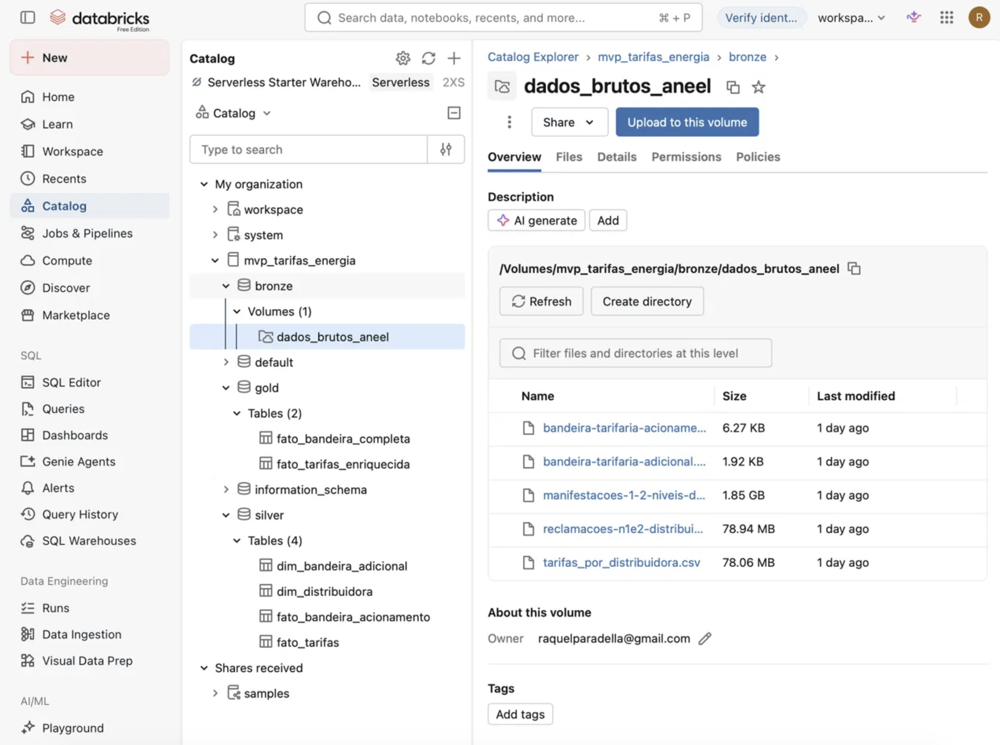
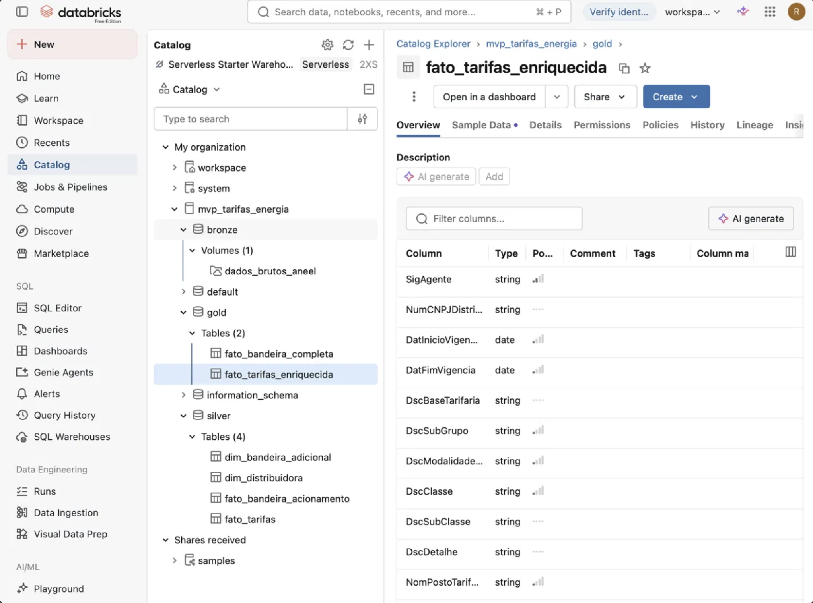
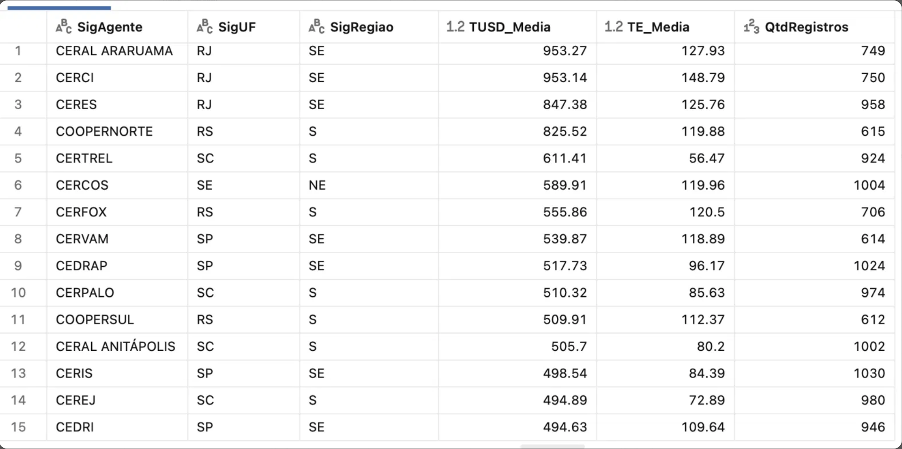
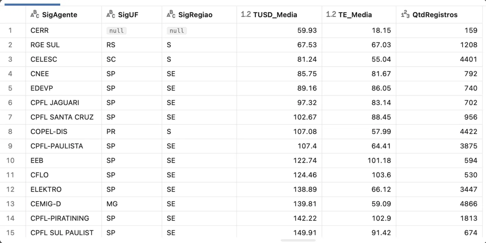
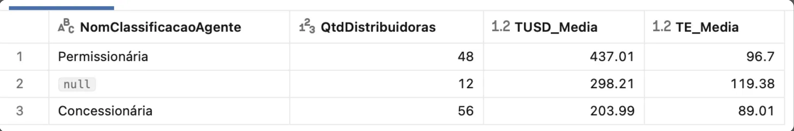
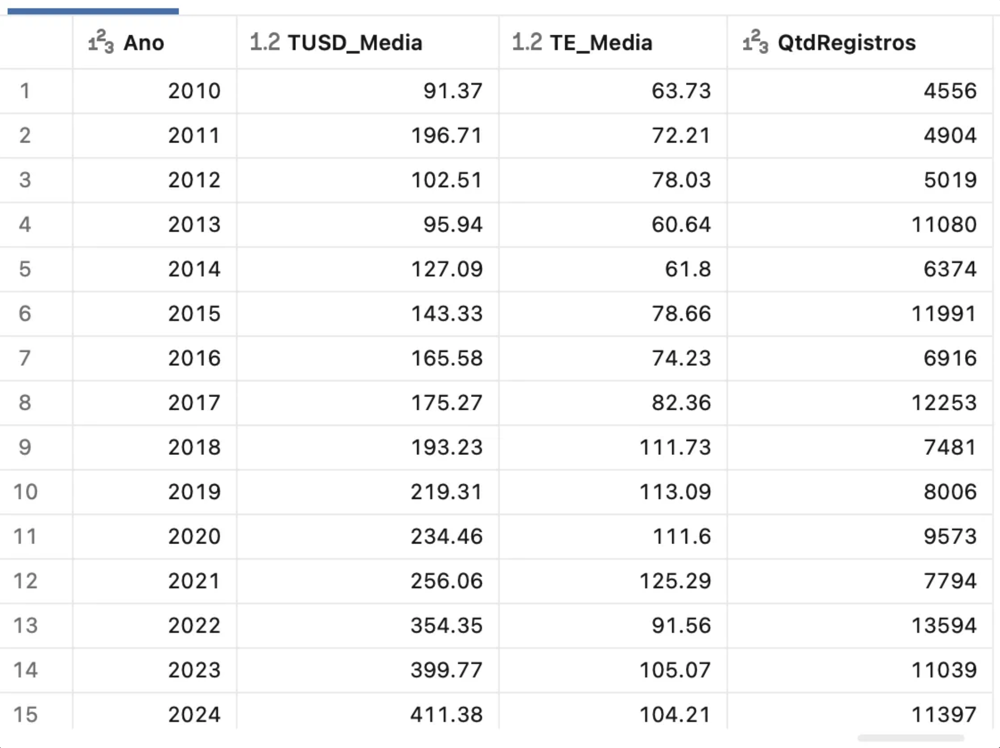
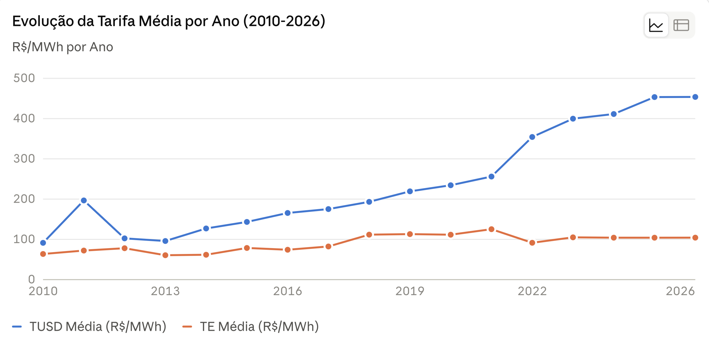
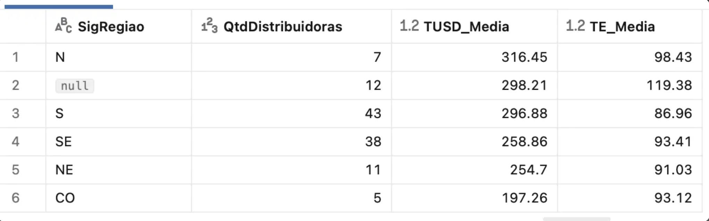
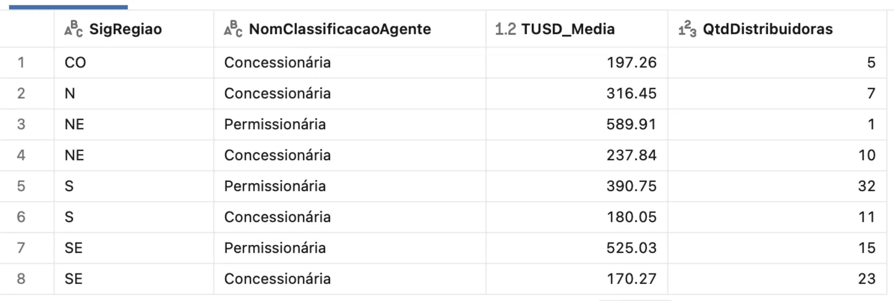
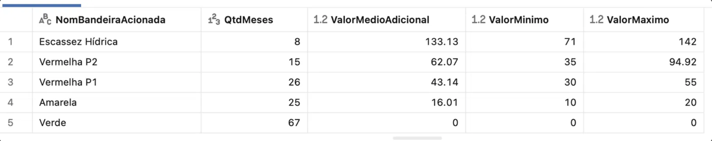

# MVP: Pipeline de Dados na Nuvem - Tarifas de Energia Elétrica no Brasil

## Contexto de Negócios e Perguntas

**Problema central:** Entender como as tarifas de energia elétrica variam entre as distribuidoras brasileiras e quais fatores estão associados a essa variação.

**Perguntas de negócio:**
1. Quais distribuidoras/estados têm as tarifas de energia mais altas e mais baixas?
2. Existe relação entre a classificação regulatória da distribuidora (Concessionária vs. Permissionária) e o valor da tarifa?
3. Como as tarifas evoluíram ao longo do tempo?
4. Existe relação entre a região geográfica e o nível de tarifa?
5. As bandeiras tarifárias têm impacto perceptível na conta final do consumidor?

**Fontes de dados e contexto:**

| Base | Fonte | Uso | Licença |
|---|---|---|---|
| Tarifas de aplicação das distribuidoras de energia elétrica | ANEEL — Portal de Dados Abertos | Base principal: TE/TUSD por distribuidora, com vigência, a partir de 2010 | Dado público governamental brasileiro |
| Reclamações no 1º e 2º nível da Distribuidora (2025) | ANEEL — Portal de Dados Abertos | Extração da relação distribuidora → UF → Região → Classificação (Concessionária/Permissionária) | Dado público governamental brasileiro |
| Bandeiras Tarifárias (Adicional + Acionamento) | ANEEL — Portal de Dados Abertos | Valor histórico de acionamento das bandeiras tarifárias, a partir de jan/2015 | Open Data Commons Open Database License (ODbL) |

---

## Carga dos Dados

Os 4 arquivos brutos (CSV) foram baixados diretamente do Portal de Dados Abertos da ANEEL e enviados via upload manual para um **Volume gerenciado do Unity Catalog** (`mvp_tarifas_energia.bronze.dados_brutos_aneel`).

**Detalhes e decisões de carga:**
- O arquivo de tarifas (`tarifas_por_distribuidora.csv`) e o de reclamações vieram separados por vírgula (`,`), com aspas duplas delimitando campos de texto que continham vírgulas internas (ex: descrições de resolução). Os arquivos de bandeira tarifária vieram separados por ponto e vírgula (`;`).
- Todos os arquivos usam encoding UTF-8 e vírgula como separador decimal (padrão brasileiro), tratado na camada Silver.
- O arquivo de reclamações (`reclamacoes-n1e2-distribuidoras-2025.csv`, ~83 MB) chegou como um **arquivo ZIP**, foi necessário um passo extra de descompactação via código (`zipfile`), documentado no notebook `01_exploracao_bronze`.
- Script de referência: `01_exploracao_bronze` (blocos 1 a 4) no repositório GitHub.

---

## Modelagem e Catálogo de Dados

**Arquitetura adotada:** Medalhão (Bronze → Silver → Gold), com catálogo `mvp_tarifas_energia` no Unity Catalog do Databricks, um schema por camada.

### Catálogo: `mvp_tarifas_energia.gold.fato_tarifas_enriquecida`

**Contexto:** Tabela fato contendo o histórico de tarifas homologadas (TE e TUSD) por distribuidora de energia elétrica brasileira, enriquecida com atributos cadastrais (UF, Região, Classificação). Linhagem: originada da base "Tarifas de aplicação das distribuidoras de energia elétrica" (ANEEL), cruzada com "Reclamações no 1º e 2º nível da Distribuidora" (ANEEL, 2025) via chave `SigAgente` normalizada + tabela de-para manual (47 correspondências de nomenclatura divergente entre fontes, documentadas na etapa de Qualidade de Dados).

| Campo | Descrição | Tipo | Domínio de valores |
|---|---|---|---|
| `SigAgente` | Sigla/nome da distribuidora, como consta na fonte original de tarifas | string | Ex: "COELBA", "CEMIG-D", "Neoenergia Coelba" — 197 valores distintos |
| `NumCNPJDistribuidora` | CNPJ da distribuidora | string | 14 dígitos numéricos |
| `DatInicioVigencia` | Data de início de vigência da tarifa | date | A partir de 2010-01-01 |
| `DatFimVigencia` | Data de fim de vigência da tarifa | date | Pode ser null (tarifa ainda vigente) |
| `DscBaseTarifaria` | Tipo de base tarifária | string | "Tarifa de Aplicação" (o que o consumidor paga) ou "Base Econômica" (uso regulatório) |
| `DscSubGrupo` | Subgrupo tarifário (tensão/porte) | string | Ex: "A1", "A2", "A4", "B1", "B2" |
| `DscModalidadeTarifaria` | Modalidade de aplicação | string | "Convencional", "Azul", "Verde", "Branca", entre outras |
| `DscClasse` | Classe de consumo | string | "Residencial", "Rural", "Iluminação Pública", "Não se aplica" |
| `DscSubClasse` | Subdivisão da classe | string | Varia conforme a classe |
| `DscDetalhe` | Critério complementar de aplicação | string | Livre, conforme resolução |
| `NomPostoTarifario` | Faixa horária (tarifas horárias) | string | "Ponta", "Fora ponta", "Intermediário", "Não se aplica" |
| `DscUnidadeTerciaria` | Unidade de medida do valor | string | "kW" ou "MWh" |
| `VlrTUSD` | Valor da Tarifa de Uso do Sistema de Distribuição | double | R$, ≥ 0 |
| `VlrTE` | Valor da Tarifa de Energia | double | R$, ≥ 0 (pode ser 0 para postos sem componente de energia) |
| `SigUF` | UF da distribuidora | string | Sigla de estado brasileiro; null para 13 de 197 distribuidoras (limitação documentada) |
| `SigRegiao` | Região geográfica | string | N, NE, CO, SE, S; null nos mesmos 13 casos |
| `NomClassificacaoAgente` | Classificação regulatória | string | "Concessionária" ou "Permissionária"; null nos mesmos 13 casos |

### Catálogo: `mvp_tarifas_energia.silver.dim_distribuidora`

**Contexto:** Tabela dimensão cadastral, extraída (via `SELECT DISTINCT`) da base de Reclamações no 1º e 2º nível da Distribuidora (ANEEL, ano-referência 2025). Usada exclusivamente como fonte de UF, Região e Classificação regulatória de cada distribuidora, os dados de reclamação em si (volume, tipo, prazo de solução) não são utilizados neste trabalho.

| Campo | Descrição | Tipo | Domínio de valores |
|---|---|---|---|
| `SigAgente` | Sigla/nome da distribuidora, como consta na base de reclamações | string | 101 distribuidoras distintas |
| `SigUF` | Sigla da unidade federativa onde a distribuidora atua | string | Siglas de estado brasileiro |
| `SigRegiao` | Região geográfica | string | N, NE, CO, SE, S |
| `NomClassificacaoAgente` | Classificação regulatória da distribuidora | string | "Concessionária" ou "Permissionária" |

**Limitação conhecida:** esta base cobre 101 distribuidoras que geraram reclamações registradas em 2025. Distribuidoras muito pequenas, sem reclamações de nível 2/ouvidoria naquele ano, não aparecem aqui mesmo existindo de fato.

---

### Catálogo: `mvp_tarifas_energia.silver.dim_bandeira_adicional`

**Contexto:** Tabela dimensão com os valores de adicional (R$/MWh) homologados por resolução da ANEEL, para cada cor de bandeira tarifária, desde 2015.

| Campo | Descrição | Tipo | Domínio de valores |
|---|---|---|---|
| `DatVigencia` | Data de início de vigência do valor homologado | date | A partir de 2015-03-02 |
| `DscResolucao` | Resolução Homologatória (REH) que aprovou o valor | string | Ex: "REH nº 1.859/2015" |
| `NomBandeiraAcionada` | Cor/tipo da bandeira | string | "Verde", "Amarela", "Vermelha P1", "Vermelha P2", "Escassez Hídrica" |
| `VlrAdicionalBandeiraRSMWh` | Valor do adicional homologado | double | R$/MWh, ≥ 0 |

---

### Catálogo: `mvp_tarifas_energia.silver.fato_bandeira_acionamento`

**Contexto:** Tabela fato com o histórico mensal de qual bandeira tarifária foi efetivamente acionada (aplicada na conta do consumidor), desde janeiro/2015.

| Campo | Descrição | Tipo | Domínio de valores |
|---|---|---|---|
| `DatCompetencia` | Mês de referência do acionamento | date | Mensal, a partir de 2015-01-01 |
| `NomBandeiraAcionada` | Cor/tipo da bandeira acionada naquele mês | string | "Verde", "Amarela", "Vermelha P1", "Vermelha P2", "Escassez Hídrica" |
| `VlrAdicionalBandeira` | Valor do adicional efetivamente aplicado naquele mês | double | R$/MWh, ≥ 0 |

---

### Catálogo: `mvp_tarifas_energia.gold.fato_bandeira_completa`

**Contexto:** Tabela fato Gold, resultado do cruzamento entre `fato_bandeira_acionamento` e `dim_bandeira_adicional`, respeitando o intervalo de vigência mensal de cada valor homologado (junção por intervalo, não por igualdade simples, uma mesma bandeira pode ter valores diferentes em períodos diferentes).

| Campo | Descrição | Tipo | Domínio de valores |
|---|---|---|---|
| `DatCompetencia` | Mês de referência do acionamento | date | Mensal, a partir de 2015-01-01 |
| `NomBandeiraAcionada` | Cor/tipo da bandeira | string | "Verde", "Amarela", "Vermelha P1", "Vermelha P2", "Escassez Hídrica" |
| `VlrAdicionalAplicadoNoMes` | Valor efetivamente aplicado na conta naquele mês (fonte: acionamento) | double | R$/MWh, ≥ 0 |
| `VlrHomologadoNaResolucao` | Valor homologado vigente naquele mês (fonte: adicional) | double | R$/MWh, ≥ 0; null para jan/fev de 2015 (não há resolução homologada anterior a mar/2015 na base) |
| `DscResolucao` | Resolução que homologou o valor vigente naquele mês | string | Ex: "REH nº 1.859/2015"; null nos mesmos casos acima |

**Achado de qualidade:** nas linhas com correspondência, `VlrAdicionalAplicadoNoMes` e `VlrHomologadoNaResolucao` coincidem exatamente, validando a consistência entre as duas fontes de bandeira tarifária.

---

## Pipeline de Dados

O pipeline foi organizado em **2 notebooks**, separando responsabilidades (construção/tratamento vs. análise):

- **`01_exploracao_bronze`**: contém todo o fluxo ETL, do dado bruto à camada Gold.
  - Blocos 1-4: leitura da camada Bronze (tarifas, bandeiras, reclamações, incluindo a descompactação do ZIP).
  - Bloco 5: extração e persistência de `silver.dim_distribuidora` (deduplicação de UF/Região/Classificação por distribuidora).
  - Bloco 6: tratamento de tipos (datas, vírgula decimal → double) e persistência de `silver.fato_tarifas`.
  - Bloco 7: tratamento e persistência das tabelas de bandeira Silver.
  - Bloco 8: tabela de-para (correção manual de divergência de nomenclatura entre fontes) + função de normalização de texto.
  - Bloco 9: JOIN final com verificação automática de integridade (contagem de linhas Silver vs. Gold antes de salvar) e persistência de `gold.fato_tarifas_enriquecida`.
  - Bloco 10: junção por intervalo de vigência mensal entre acionamento e valor homologado de bandeira, e persistência de `gold.fato_bandeira_completa`.
- **`02_analise_final`**: contém apenas as consultas SQL que respondem às 5 perguntas do objetivo, executadas sobre as tabelas Gold.

Todas as tabelas foram persistidas como **tabelas Delta gerenciadas** (`saveAsTable`), organizadas em 3 schemas dentro do catálogo `mvp_tarifas_energia`: `bronze` (Volume com arquivos brutos), `silver` (tabelas limpas e tipadas) e `gold` (tabelas de negócio, prontas para responder as perguntas).

Scripts de referência: `01_exploracao_bronze` e `02_analise_final` no repositório GitHub.

---

## Qualidade de Dados

### Problema 1: Divergência de nomenclatura entre fontes (chave de junção inconsistente)

Ao cruzar `fato_tarifas` com `dim_distribuidora` por `SigAgente`, um JOIN direto resultou em **108 de 197 distribuidoras (55%) sem correspondência**. Não por ausência de dados, mas por **divergência sistemática de convenção de nomenclatura** entre as duas bases da própria ANEEL (ex: `COELBA` na base de tarifas vs. `Neoenergia Coelba` no cadastro; `CEMIG-D` vs. `Cemig`; `CPFL-PAULISTA` vs. `CPFL Paulista`).

**Tratamento aplicado:**
1. Normalização de texto (remoção de acentos, padronização de maiúsculas/minúsculas e espaçamento) resolveu parte dos casos mecânicos.
2. Pesquisa em fontes oficiais (resoluções ANEEL, ofícios circulares, notícias do setor) para construir uma tabela de-para manual com 47 correspondências, cobrindo fusões societárias (ex: CFLO, CNEE, EDEVP, EEB → Energisa Sul-Sudeste, todas incorporadas em 2017), mudanças de marca (ex: COELBA → Neoenergia Coelba) e siglas internas de grupo (Energisa: EAC, EMR, EMS, EMT, EPB, ERO, ESE, ESS, ETO).

**Resultado final:** 13 de 197 distribuidoras (6,6%) permaneceram sem correspondência, documentadas como limitação.

### Problema 2: Duplicação de linhas por normalização excessiva

Uma primeira versão da normalização automática usava regex para remover sufixos comuns (`-D`, `-DIS`, `-DISTRIBUICAO`) do final dos nomes. Isso causou um efeito colateral grave: nomes distintos que compartilhavam prefixo (ex: `Ceral`, `Ceral Araruama`, `Ceral Anitápolis`) colapsaram na mesma chave normalizada, fazendo o JOIN encontrar múltiplas correspondências para uma mesma linha de tarifa, duplicando registros.

**Correção:** a normalização automática foi restringida a tratar apenas acento, caixa (maiúsculo/minúsculo) e espaçamento, nunca removendo palavras ou sufixos por regex. Os casos de sufixo (`-D`, `-DIS`) passaram a ser tratados individualmente na tabela de-para manual. Foi adicionada uma **verificação automática de integridade** no pipeline: antes de salvar a tabela Gold, o notebook compara a contagem de linhas da tabela Silver de origem com a da tabela Gold resultante. Um alerta é emitido (e a gravação é bloqueada) caso os números não coincidam.

### Limitações documentadas (aceitas conscientemente)

- **13 distribuidoras sem UF/Região/Classificação** na tabela `gold.fato_tarifas_enriquecida`: `CERR`, `CERTAJA`, `CODESAM`, `COORSEL`, `EBO`, `EFLJC`, `ELFSM`, `ENF`, `MUXENERGIA`, `Não Informado`, `Pacto Energia PR`, `UHENPAL`. A maioria são distribuidoras pequenas confirmadas como reais (por pesquisa externa), mas que não geraram reclamações de nível 2 registradas em 2025 (limitação de cobertura da base complementar). `CERR` não foi identificada em nenhuma fonte consultada.
- **`jan/fev de 2015`** na tabela `gold.fato_bandeira_completa` ficam sem valor homologado correspondente, pois não há resolução da ANEEL anterior a março/2015 disponível na base de "Adicional".

---

## Análise de Dados

### Pergunta 1: Quais distribuidoras/estados têm as tarifas mais altas e mais baixas?

Tarifas mais altas concentradas em cooperativas rurais pequenas (Ceral Araruama, Cerci, Ceres, Coopernorte, Certrel — TUSD média R$500-950/MWh). Tarifas mais baixas em grandes distribuidoras urbanas (RGE, Celesc, Copel, CPFL Paulista, Elektro, Cemig-D — TUSD média R$67-150/MWh). Hipótese: economia de escala, menor densidade populacional implica maior custo de distribuição por consumidor.

### Pergunta 2: Relação entre Concessionária vs. Permissionária e tarifa

Permissionária tem TUSD média R$437,01/MWh (48 distribuidoras) vs. Concessionária R$203,99/MWh (56 distribuidoras): mais que o dobro, confirmando a hipótese da Pergunta 1.

### Pergunta 3: Evolução das tarifas ao longo do tempo

TUSD média cresce quase 5x de 2010 (R$91,37/MWh) a 2026 (R$453,81/MWh), com salto expressivo a partir de 2021-2022. TE média oscila sem tendência clara (R$60-125/MWh), sugere que o componente de distribuição (TUSD), não o de energia (TE), é o principal motor do aumento das tarifas ao longo do tempo.

### Pergunta 4: Relação entre região geográfica e nível de tarifa

Tarifa regional bruta mostra N (R$316), S (R$297), SE (R$259) mais caros e CO (R$197) mais barato. Ao controlar por classificação, Concessionárias ficam homogêneas entre regiões (R$170-238, exceto N com R$316 por fatores logísticos), enquanto Permissionárias disparam (R$390-590). Sul concentra 32 das permissionárias do país (vs. 15 no SE, 1 no NE, 0 em CO/N). A "tarifa regional alta" é majoritariamente efeito de composição (concentração de cooperativas), não característica geográfica pura.

### Pergunta 5: Impacto das bandeiras tarifárias na conta final

Impacto cresce por severidade: Verde (67 meses, R$0), Amarela (25 meses, R$16,01/MWh), Vermelha P1 (26 meses, R$43,14/MWh), Vermelha P2 (15 meses, R$62,07/MWh), Escassez Hídrica (8 meses, R$133,13/MWh — quase 8x a Amarela). Escassez Hídrica sozinha mais que dobra a TE média recente (~R$104/MWh).

### Discussão Geral

As cinco respostas, tomadas em conjunto, convergem para uma narrativa coerente: **o porte e o modelo regulatório da distribuidora explicam a variação de tarifa muito melhor do que a localização geográfica isolada**. Cooperativas de eletrificação rural (Permissionárias) cobram, em média, mais que o dobro das grandes distribuidoras urbanas (Concessionárias), um reflexo direto da menor densidade populacional e do maior custo de manutenção de rede por consumidor atendido. O aparente "efeito regional" observado inicialmente na Pergunta 4 (Sul e Norte com tarifas mais altas) se mostrou, em grande parte, um efeito de composição: o Sul concentra a maior parte das cooperativas do país, e ao isolar apenas as Concessionárias, a diferença regional praticamente desaparece (exceto no Norte, onde fatores logísticos genuínos, como grandes distâncias e baixa densidade, parecem pesar mesmo entre concessionárias).

A dimensão temporal (Pergunta 3) reforça essa leitura: o crescimento de quase 5x na TUSD entre 2010 e 2026 (contra uma TE praticamente estável) indica que o componente de **distribuição**, exatamente aquele que mais penaliza áreas de baixa densidade, é o principal motor do aumento da conta de energia ao longo do tempo, não o custo da energia em si.

Por fim, as bandeiras tarifárias (Pergunta 5) mostram que, além da estrutura tarifária de base, o consumidor está sujeito a choques adicionais ligados a condições hidrológicas. A bandeira de Escassez Hídrica, mesmo pouco frequente (8 de 141 meses), praticamente dobra o custo de energia quando acionada, evidenciando a vulnerabilidade do sistema a eventos climáticos extremos.

---

## Autoavaliação

**Objetivos atingidos:** as cinco perguntas formuladas na etapa de Objetivo foram todas respondidas com dados reais e rastreáveis, e a pergunta 2 exigiu um ajuste consciente de escopo logo na etapa de busca de dados: a ideia original ("estatal vs. privada") foi substituída por uma distinção regulatória equivalente e efetivamente disponível em fonte pública (Concessionária vs. Permissionária), evitando qualquer categorização especulativa ou não rastreável a dado oficial.

**Dificuldades encontradas:** o maior desafio do trabalho não foi técnico no sentido de ferramentas, mas de **qualidade e consistência de dados entre fontes da mesma instituição**. A divergência de nomenclatura de distribuidoras entre a base de tarifas e a base de reclamações (ambas da ANEEL) exigiu uma investigação extensa, incluindo pesquisa em resoluções regulatórias e notícias do setor para confirmar fusões societárias (ex: Energisa Sul-Sudeste incorporando quatro siglas antigas). Um erro de percurso também gerou aprendizado real: uma primeira tentativa de normalização automática (via regex, removendo sufixos) causou duplicação silenciosa de linhas, ao colapsar nomes de distribuidoras distintas na mesma chave, um erro que só foi percebido porque os resultados da Pergunta 1 tinham linhas repetidas. Isso reforçou a importância de **verificações de integridade explícitas** no pipeline (contagem de linhas antes/depois de cada JOIN), que passaram a fazer parte do processo daqui em diante.

**Limitações conhecidas:** 13 de 197 distribuidoras (6,6%) permanecem sem UF/Região/Classificação, por indisponibilidade de cobertura na base complementar de reclamações: decisão consciente de não investigar exaustivamente casos de distribuidoras muito pequenas.

**Trabalhos futuros:** (1) buscar uma fonte cadastral primária de distribuidoras (não derivada de reclamações) para eliminar de vez a limitação dos 13 casos; (2) incorporar dados de consumo por classe/UF para ponderar as médias de tarifa pelo volume real de energia consumido, em vez de médias simples; (3) investigar a causa do salto de TUSD em 2021-2022 (Pergunta 3) cruzando com dados de reajuste tarifário extraordinário da ANEEL, para confirmar a hipótese de relação com a crise hídrica.
